# Delivery screenshot gallery

These are native 1280 × 720 game captures, stored as JPEG documentation images.
The gallery illustrates six office locations, three industrial locations, three
tunnel locations and the three creature types. The complete QA also inspected
all directions at route stops, including close walls; this gallery selects one
direction per location. Seeds, positions and runtime titles are in
[the manifest](screenshots/manifest.json).

Office and tunnel captures use world format 48; format 49 changes only industrial
beam attachment and closes beam undersides. Industrial captures use final format
49. Creature captures use format 47; their meshes and behavior remain unchanged.

## Level 0 — The Yellow Rooms

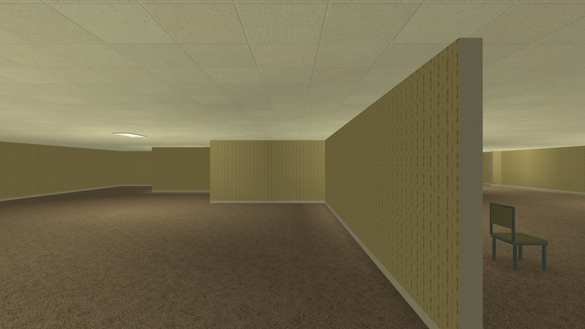

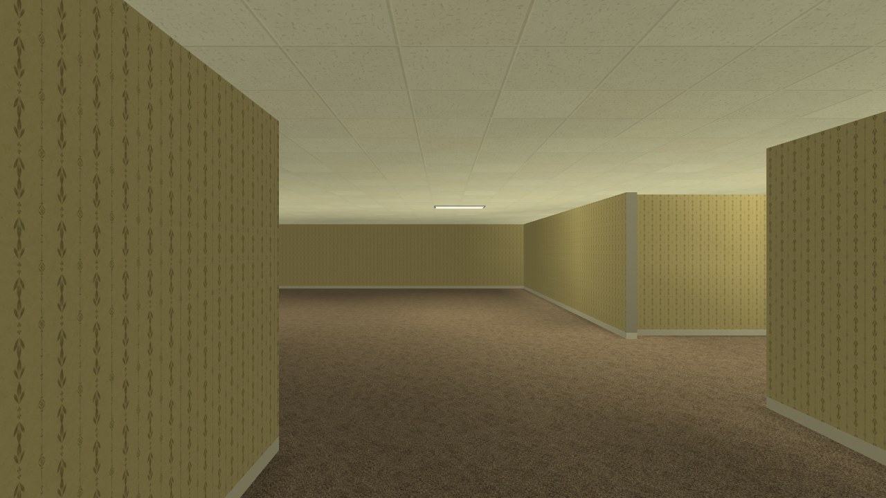

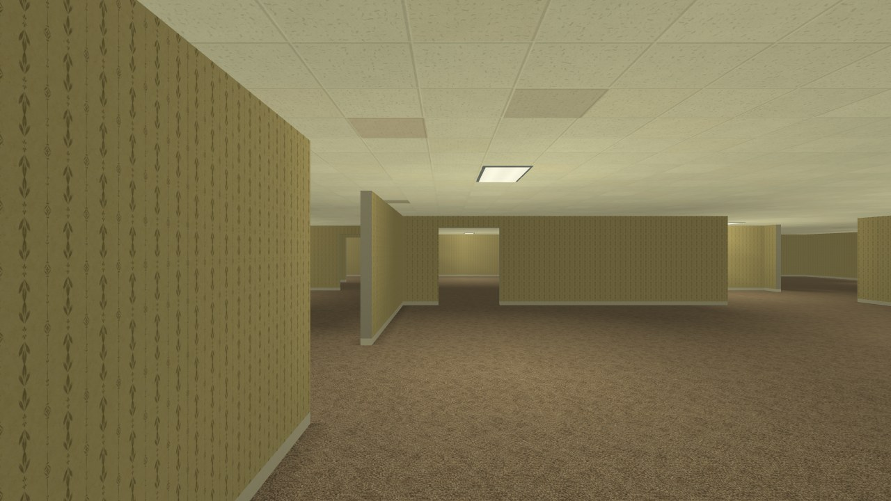

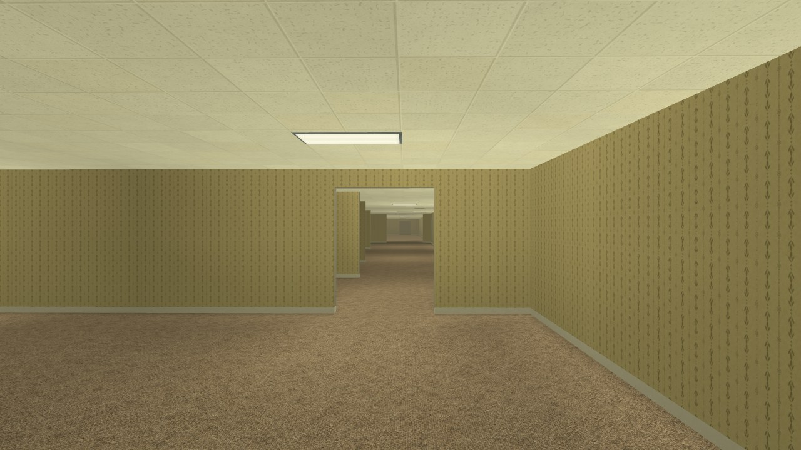

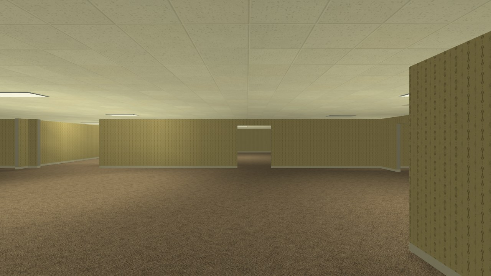

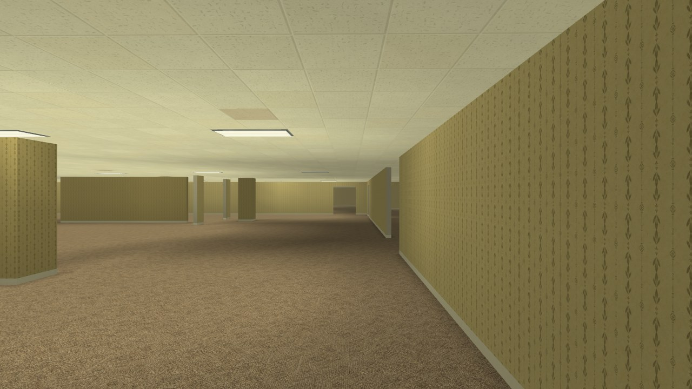

## Level 1 — Service Storage

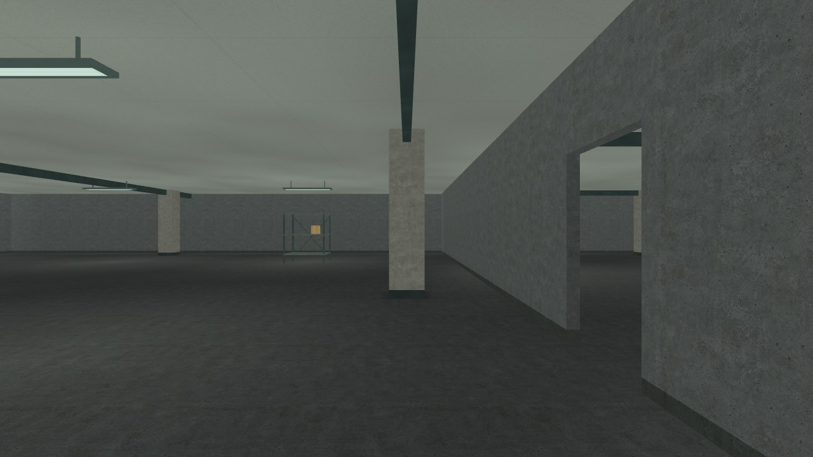

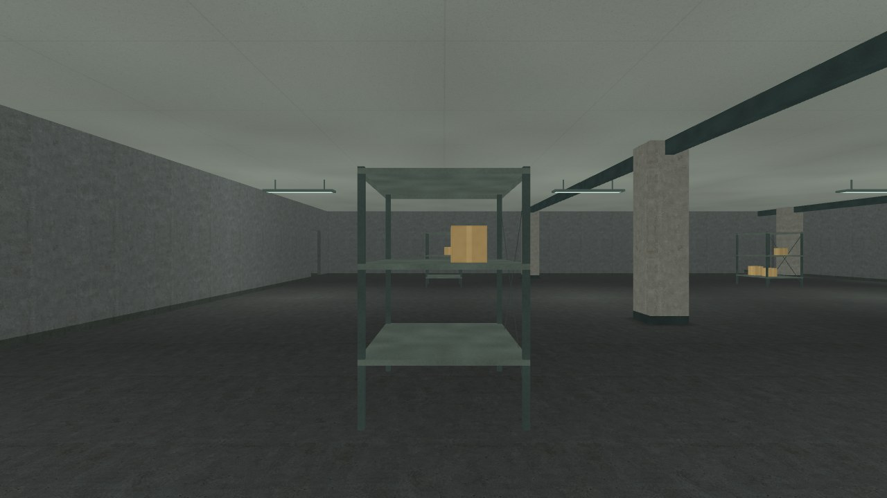

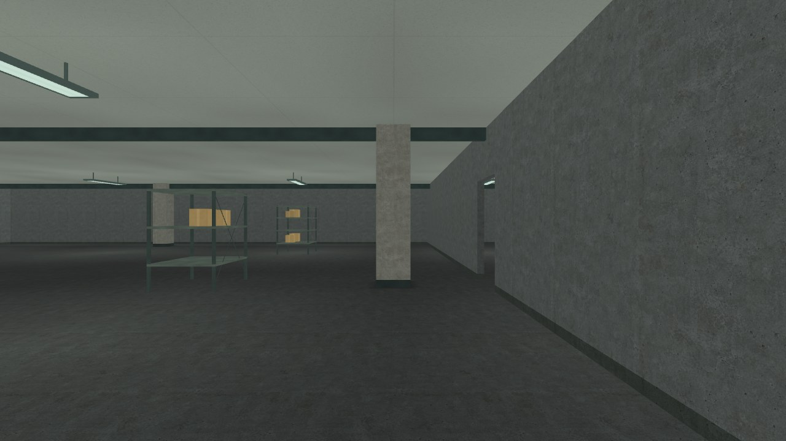

## Level 2 — Maintenance Tunnels

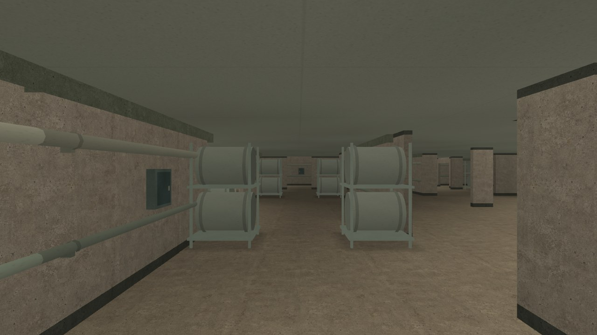

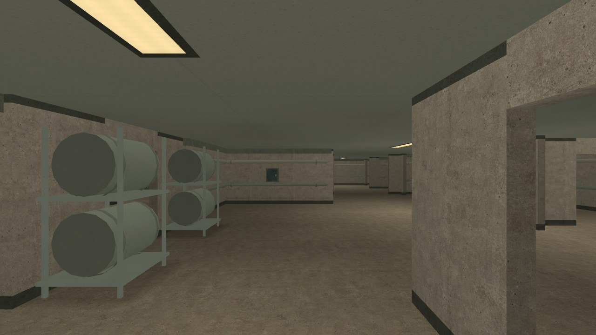

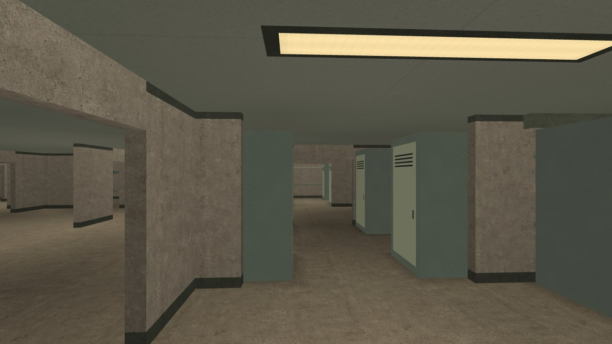

## Harmless inhabitants

All three fade near the player. Their sparse voices are licensed CC0; none can
attack, damage, chase or block the player.

### Wanderer

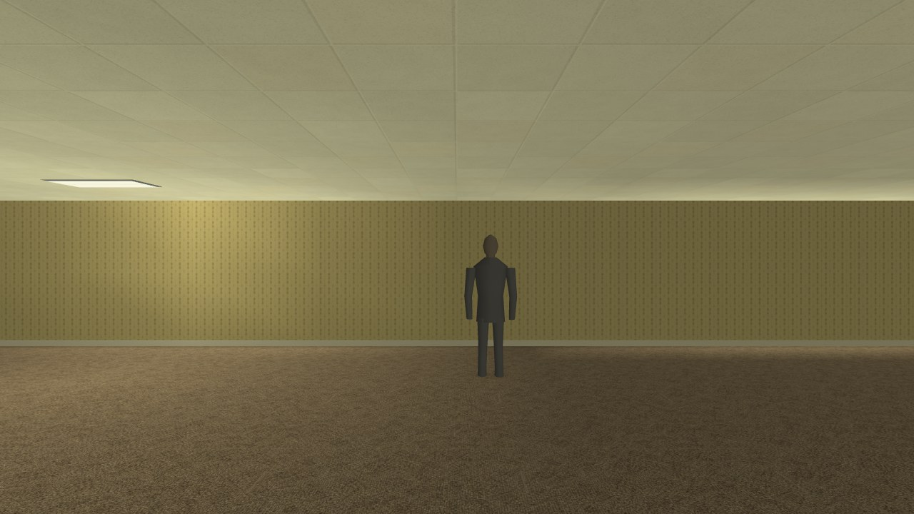

### Watcher

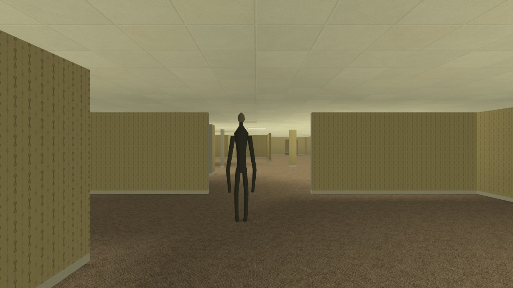

### Crawler

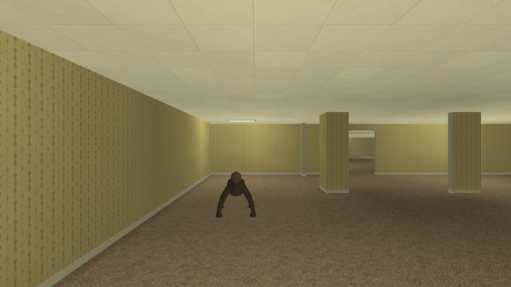
